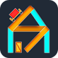

## 🚀 Hey there! I'm Kostia Makrasnov 🚀
You are looking at a fairly locked-down version of my entire programming journey. To learn more about the type of work that I do and love, please check out my published projects below. 

In addition to being part of an 🔥 amazing team 🔥 responsible for developing the industry-transforming Security Management Orchestration (SMO) software at [Rivial Data Security](https://www.rivialsecurity.com/), here are some of my most notable personal projects:
 
 

<h3>PicaBook 🎨</h3>

Subscription based picture book creation and sharing platform for children and their parents. 

&nbsp;

<h3>RoboSquare 🤖</h3>

Desktop party game with a battle-bots inspired PVP arena gameplay. 

&nbsp;

<h3>PYM 🎶</h3>

Software and utilities for creating, editing, and syncing songs/events for a local youth group. <i>Created for Pilgrim Youth Ministries.</i>

&nbsp;

<h3>The Voice of Pilgrim 📻</h3>

Mobile app for listening to online christian radio stations. <i>Created for Pilgrim Slavic Baptist Church.</i>

&nbsp;

<h3> Sandbox Anything 🧩</h3>

Multiplayer desktop puzzle game with a unique spring physics dragging mechanic.

&nbsp;

<h3>Imago Spectrum 🎥</h3>

Automated video pipeline for generating English word definition explainers.

&nbsp;

<h3>Answer Me 🙋🏼‍</h3>

Mobile app for asking and answering everyday questions.

&nbsp;

 

Got an 💡 idea 💡 for a great mobile app or software-as-a-service project? Contact me - <i>support@myfortuna.app</i>

 

